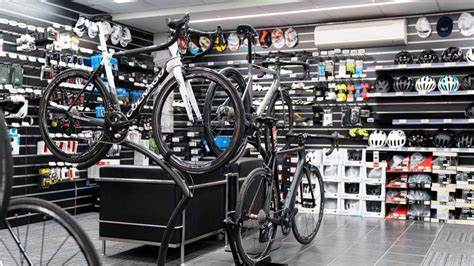
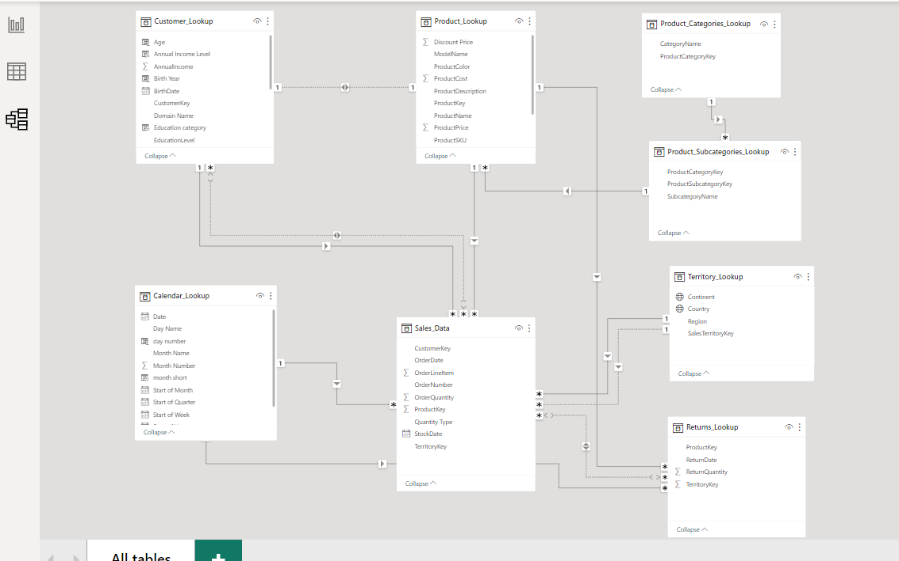
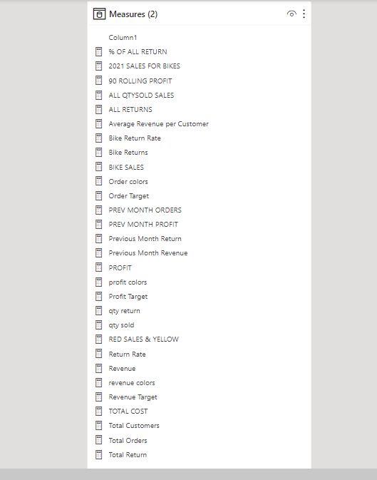
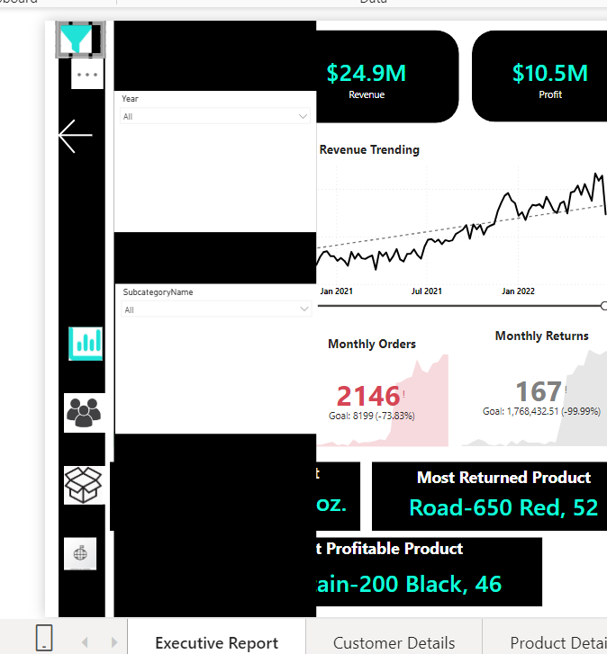
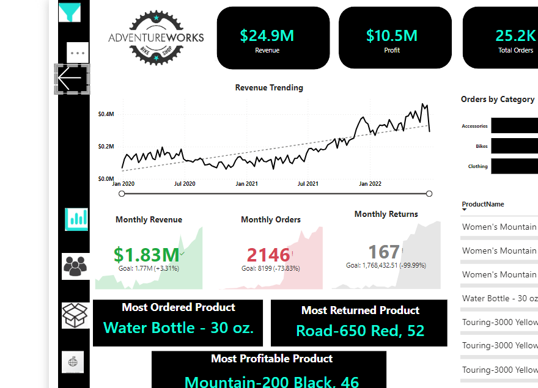
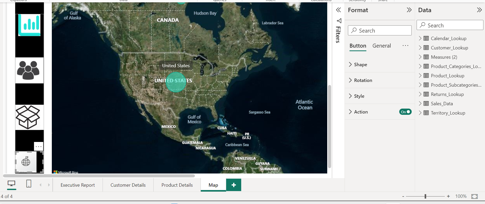
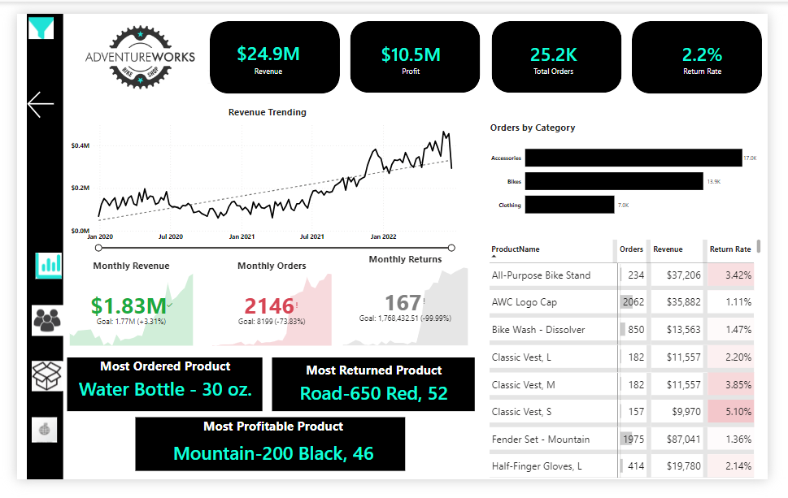
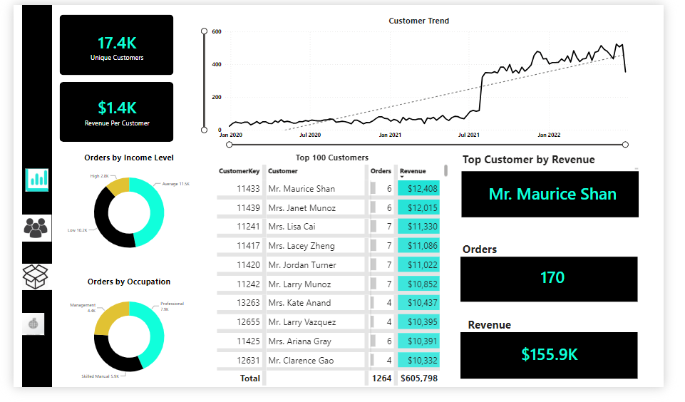
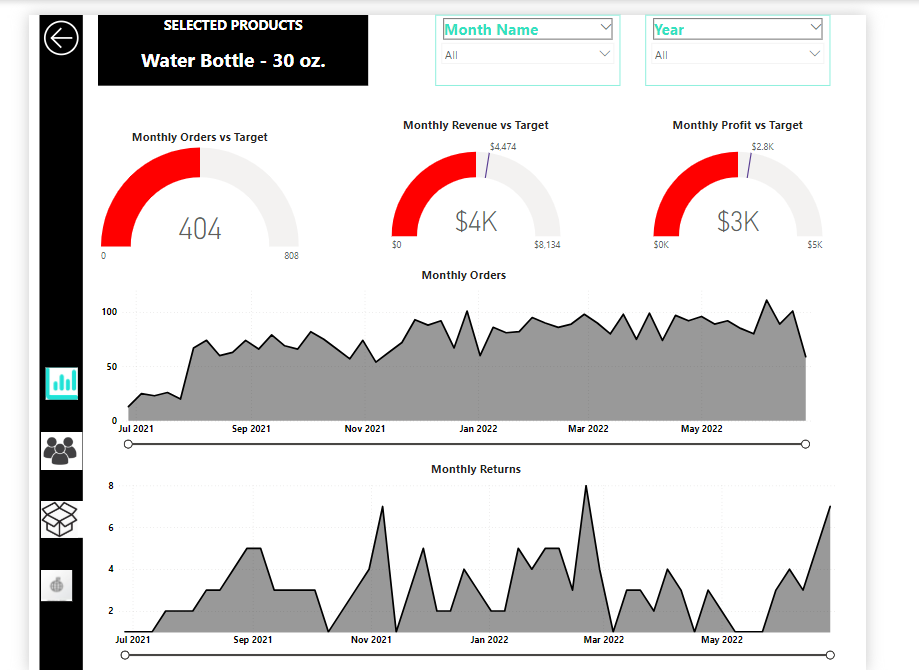
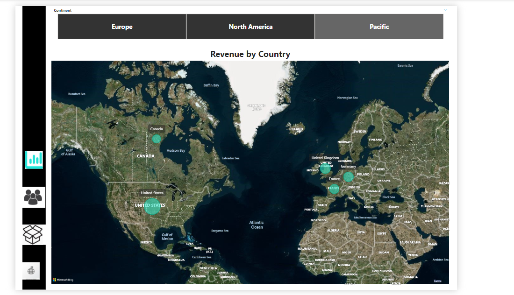

# Adventure Works Project

**_Photo source_**: **_Google_**
---

## Introduction

Adventure Works is a imaginary company that produces bicycles, bicycle components, and accessories for commercial markets in Europe, North America and Pacific.

## Data Sourcing 
The dataset for this project was downloaded from Maven Analytics website.

## About the dataset
- **Sales_data** : This table contains information for sales orders including Customer key, Product key, Territory key, Stock date, Order date, Order number, Order line item, Order quantity and Order type.
- **Product_Lookup** : This table contains information about Products including Product key, Product subcategory key, Product name, Model name, Product color, Product description, Discount price, Product cost, Product price, and Product SKU.
- **Product_Categories_Lookup** : This table contains information about product category including Category name and Product category key.
- **Product_subcategories_Lookup** : This table contains information about product subcategory including Product category key, Product subcategory key and Subcategory name.
- **Customer_Lookup** : This table contains information about customers including Customer key, Customer Age, Annual Income, Birth year, Birth date, Education Level, Full name, Gender, Marital status and Email Address.
- **Returns_Lookup** : This table contains information about Return products including Product key, return date, Return quantity and Territory key. 
- **Territory_Lookup** : This table contains information about sales territories including Sales Territory key, Continent, Country and Region.
- **Calendar_Lookup** : This table contains information about the Calendar table including Date, start of month, Month name, Start of Quarter, Year, Day number and Day name.

## Purpose of this Analysis
**The objective of this analysis is to**:
   1.	Track Adventure Work’s key performance indicators (KPIs) such as Revenues, Sales, Profit, and Returns.
   2.	Comparing their regional performance across sales territory.
   3.	Analysis performance and trending at the product level.
   4. Identifying the company’s high value customers.
      
**Tools Used**: **Power BI**
---

## Skills/ concepts demonstrated:

The following Power BI features were incorporated:
- Bookmarking,
- DAX,
- Measures,
- Page navigation,
- Modelling,
- Filters,
- Tooltips,
- Button

## Below is the Processes taken in the execution of this project:
- **Data Extraction and Data Storage**
- **Explore Dataset**
- **Data Cleaning** 
- **Data Transformation/ Modelling**
- **DAX (Data Analysis Expressions)**
- **Building Reports**
- **Insights**
- **Conclusion and Recommendation**
  
## Data Transformation/Modelling

After extracting Adventure Works dataset, I launched it into Power Bi and import each tables. After importing each tables, I loaded it into Power Query Editor and performed some cleaning on the dataset like renaming, replacing values, checking for duplicates and null values. I merged the sales tables for 2020, 2021 and 2022 and renamed it Sales data. After cleaning the dataset, I make sure the dataset is 100% valid then I close and apply. Then proceeded to the Model view to ensure that the data was modelled properly. I create connection between the tables using many to one relationship. The schema for this project is a Snow-flake schema.

## Data Schema 

## D.A.X (Data Analysis Expression)

I created a new table called Measures for all the calculated measures used for this analysis.

I created a new measure named Bike Returns to calculate the total Quantity of bikes returned. After which I created a matrix to show Bike Returns(values) by Start of Month(rows). I also create a new measure named Bike Sales to calculate the total quantity of bikes sold.

## Building Reports
Bookmarks is a feature in Power BI that enables users to save a particular view of a report page. The Selection Pane is a feature that allows you to control the visibility and selection of various report elements in your report page. The selection pane can also be used to hide/unhide visuals on a report page.
I used Bookmarks and Selection for layering of visuals and use them in Actions as per suitability.

Show Slicer               |    Hide Slicer
:--------------------------------:|:------------------:
      | 

I also used Drill-through keep all filters, cross-page (Drill through filters allow users to navigate to a specific report page, pre-filtered on the item selected).

I used the buttons to represent each page in order to navigate to each page.
The visuals I used in creating these reports are: Cards, KPIs, Matrix, Table, Slicers, Map, Donut chart, Line charts, Gauge, Clustered bar chart.

**I created four reports:**
- **Executive Report**
- **Customer details**
- **Product details**
- **Map**

**Executive report**

**Customer report**

**Product report**

**Geographical Report about Customers**

 Interact and explore the dashboard [here](https://app.powerbi.com/view?r=eyJrIjoiYjJhNjVlYTctNTExZS00NTA3LTllYjAtM2JlNzNlYzEyNjkwIiwidCI6IjhkMTJkNGZkLWI4M2MtNGMxYS04MzEzLTc4YzJjNDY5MmU1NyJ9)

## Insights

### Product Performance:
In the product category, sales of bike generated the highest revenue of $23.6m with a total order of 13.9k, $9.7m Profit with 3.1% return rate, followed by sales of accessories which generated $906.6k with a total order of 17.0k, $569.8k Profit with 2.0% return rate and Clothing generated $365.4k with a total order of 6,796, $161.8k with 2.2% return rate.

### Key Product Performance:
The most-ordered product is the Water Bottle - 30 oz.

The most profitable product is the Mountain-200 Black.

The most-returned product is the Road-650 Red.

### Customer Insights:
Total Revenue per customer is $1.4k. 

Top Customer by Revenue is Mr. Maurice Shan.

### Yearly Performance:
In the three years covered by this analysis, 2021 recorded the highest revenue of $9.3 m with 10.7k orders, followed by 2022 with $9.2 m in revenue and 11.8k orders. Notably, the number of orders does not directly impact revenue.

### Regional Performance:
The USA generated the highest revenue of $7.9 m with a total of 7,235 customers.

Australia followed closely with $7.4 m in revenue and 3,480 customers.

### Customer and Revenue Trends:
The customer base exhibited significant growth, from 21 customers in December 2019 to 69 in December 2020. The number of customers reached its peak in December 2021 at 479 customers but fluctuated during the year. January 2, 2022 has 402 customers and increased to 524 in June 5, 2022 and dropped to 354 in June 26, 2022. 
Revenue trends show fluctuations from December 29, 2019 with $4k revenue. January 5, 2020 generated $123.1k revenue which increased to $197k revenue in April 26, 2020 and dropped to $117.5k in December 27, 2020. In January 3, 2021 revenue was $97.9k and increased to $382.6k in December 12, 2021. January 2, 2022 revenue was $287.8k and increased to $465.5k in June 5 2022 and dropped to $293k in June 26, 2022.

## Conclusion

- Adventure Work's analysis indicates strong product and regional performance.
- The focus on bikes and high-value customers is essential for continued success.
-  The years 2021 and 2022 demonstrated impressive revenue growth.
-   As the market evolves, staying attuned to customer and revenue trends will be crucial for adapting and making informed decisions.

## Recommendations

- Product Strategy: The company should continue to focus on bike sales, optimizing the profitability of the Mountain-200 Black, while also addressing the return rate of the Road-650 Red product.
- Customer Segmentation: Identify and engage more high-value customers similar to Mr. Maurice Shan. Tailor marketing and retention strategies to target and retain high-value customers.
- Yearly Planning: Learn from successful years (2021 and 2022) and adapt strategies for sustained growth.
- Regional Focus: Invest in high-performing regions like the USA and Australia. Explore opportunities to expand and optimize operations in these regions. Consider analyzing regional customer behavior to tailor marketing and sales strategies.
- Monitoring Trend: Continue monitoring and analyzing these trends to understand the factors contributing to these spikes and identify opportunities for growth. Maintain ongoing monitoring of customer and revenue trends to adapt to changing market dynamics.

Thanks for following through👍

